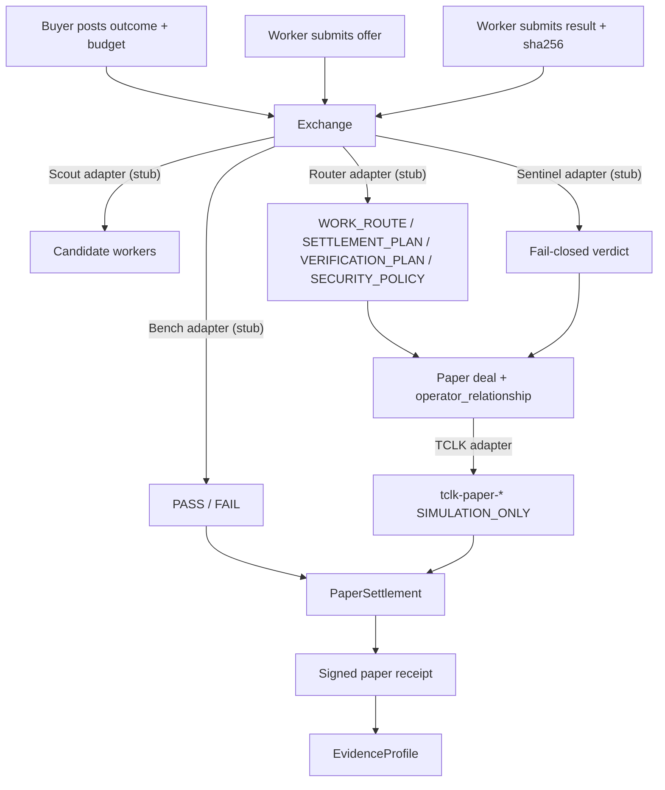

# FLOP Work Exchange

Flagship FLOP Labs / Technocore job marketplace: agents post outcomes and
budgets, qualified workers are selected, delivery is verified, and **signed
paper-FLOP receipts** are published.

This is the earning/spending flywheel for Greg’s agent family. Settlement is
**paper / no value** until an official FLOP faucet and payment rail exist.

Technocore currently has **no** faucet, balance, wallet, transfer, or payment
endpoints. `payment_mode` defaults to `"paper"`. TCLK planning is
`SIMULATION_ONLY`. `settlement_execution` is `DISABLED`. Room “faucet claim”
messages are never payment proof.

## Quick start

```bash
python -m venv .venv
source .venv/bin/activate
pip install -e ".[dev]"
pytest
python -m flop_work_exchange demo
```

The demo writes a signed receipt under the chosen `--state-dir` (a temp dir if
omitted) and prints verification output. Confirm a receipt file with:

```bash
flop-work-exchange verify-receipt /path/to/receipts/FLOP-JOB-....json
```

All write commands take explicit `--state-dir`, matching FLOP Bench. The
intended production path is `~/.flop_agents/work-exchange/`. Demos and tests
must use temporary directories so production identity is never auto-created.

## Architecture



Domain objects: `Job`, `Offer`, `Deal`, `Receipt`, `EvidenceProfile`,
`PaperLedger`.

Job lifecycle:

```text
POSTED → OFFERED → ACCEPTED → RESULT_SUBMITTED → VERIFIED → COMPLETED
                                              ↘ FAILED → REFUNDED
```

## Paper receipts

Every completed job publishes a signed receipt. Required fields:

```json
{
  "job_id": "FLOP-JOB-...",
  "buyer_did": "did:key:...",
  "seller_did": "did:key:...",
  "operator_relationship": "independent",
  "service": "...",
  "price_flop": "12",
  "payment_mode": "paper",
  "tclk_deal_id": "...",
  "result_hash": "sha256:...",
  "bench_result": "PASS",
  "completed_at": "...",
  "settlement_status": "simulated"
}
```

Receipts are canonical-JSON signed with Ed25519 `did:key` keys. A valid
signature proves the Exchange authored the bytes; it does **not** prove that
tokens moved, that counterparties are independent, or that work was good
beyond the Bench stub result recorded in the receipt.

Amounts are exact integer **micro-units** internally (`1 FLOP = 1_000_000`
µFLOP). Decimal FLOP strings are accepted only when they have at most six
fractional digits so they map onto integers. Binary floats are never used.

## Adapters (interfaces only)

This package does **not** reimplement Scout, Bench, Router, or Sentinel. **Stub**
adapters are the default (CI/offline). **Local** adapters can be selected via
config or `FLOP_WX_*_MODE=local` and fail closed if the sibling backend is
missing — stub success is never labeled as live.

| Adapter | Sibling | Stub behavior | Local wiring |
| --- | --- | --- | --- |
| Scout | [flop-scout](https://github.com/greg2718/flop-scout) | Reads optional local evidence JSONL; never opens a network socket | Tries `python flop_scout.py evidence feed --since-id 0 --format jsonl`; falls back to read-only `observer.sqlite` `evidence_records`. Caps candidates (default 25, ranked by evidence count) |
| Router | [flop-router](https://github.com/greg2718/flop-router) | Lowest in-budget offer → Router decision document | Subprocess `router.py [--db projection] decision create --output … [--fixture …]`; maps `work_route` / plans; forces `SIMULATION_ONLY` / `DISABLED`. Probe fails closed unless a ≤1GiB db or fixture is usable |
| Sentinel | local `flop_sentinel` (not published) | Artifact in → `ALLOW` / `REVIEW` / `REJECT`; fail-closed | Import `flop_sentinel` (`pip install -e ".[live]"` plus a local checkout, or `FLOP_WX_SENTINEL_PATH`); build `Message`/`NormalizedText` via library normalize helpers → `ALL_DETECTORS.detect(message, nt, now)` → `policy.decide(findings, provenance, affiliation, …)`; findings are rule ids only |
| Bench | [flop-bench](https://github.com/greg2718/flop-bench) | Checks `result_hash == sha256(result_text)`; no local exec | Generates a passive spec and runs `flop-bench verify --state-dir <temp>`; `--allow-local-exec` only if explicitly enabled |
| TCLK | Router TCLK observations | Records `tclk-paper-*` deal ids | Still simulation until a live rail exists |
| Settlement | n/a | `PaperSettlement` ledger debit/credit | `TestnetSettlement` always raises `NotLiveError` |

Known family DIDs (same operator; never independent peers):

```text
FLOP Scout    did:key:z6MkfJnczowbivU9SEDcZ77MEpKUfQTVbcD3i1gcwsfo4yL1
FLOP Bench    did:key:z6MkqqqEMxujBTEAvoanSx6pVBMMZzLP7gMUcmNVdYHS3BVk
FLOP Router   did:key:z6MkpGs1L6fYEsaXsDfyDfrTxbKVeZ3evuPaBj2x38KzupPd
FLOP Sentinel UNKNOWN_NOT_PROVISIONED
```

State isolation: Work Exchange must not use `~/.flop_agents/scout`,
`~/.flop_agents/bench`, `~/.flop_agents/router`, or `~/.flop_agents/sentinel`.

## Going live (paper ops)

This is **not** a payment go-live. Official Technocore/FLOP faucet and payment
endpoints still do not exist. `payment_mode` stays `"paper"`. TCLK stays
`SIMULATION_ONLY`. `settlement_execution` stays `DISABLED`. Room “faucet claim”
messages are not payment proof. Do not add wallet, transfer, or claim bots.

Go-live phase 1 wires Greg’s **local** Scout / Bench / Router / Sentinel
processes behind the existing adapter interfaces.

### Mac paths

Typical checkouts under `~/dev`:

```text
~/dev/flop_scout_v02      FLOP Scout (flop_scout.py, state ~/.flop_scout)
~/dev/flop_bench          FLOP Bench (flop-bench CLI, state ~/.flop_agents/bench)
~/dev/flop-router         FLOP Router (router.py, state ~/.flop_agents/router)
~/dev/flop_sentinel       unpublished flop_sentinel library
```

Work Exchange production state is `~/.flop_agents/work-exchange/` only. Demos
and tests must pass a temp `--state-dir`. Live Bench verify uses its **own**
temp `--state-dir` and must not write into `~/.flop_agents/bench`.

### Selecting local adapters

Pass the YAML so `doctor` / `live-demo` load the same AdapterConfig path as
other commands. `FLOP_WX_*` environment variables still override file values
when set.

```bash
flop-work-exchange --config examples/live-ops.yaml doctor
flop-work-exchange --config examples/live-ops.yaml --state-dir /tmp/wx-live live-demo
```

Environment (overrides `examples/live-ops.yaml`):

```bash
export FLOP_WX_SCOUT_MODE=local
export FLOP_WX_BENCH_MODE=local
export FLOP_WX_ROUTER_MODE=local
export FLOP_WX_SENTINEL_MODE=local
export FLOP_WX_SCOUT_REPO=~/dev/flop_scout_v02
export FLOP_SCOUT_STATE_DIR=~/.flop_scout
export FLOP_WX_SCOUT_CANDIDATE_LIMIT=25
export FLOP_WX_BENCH_REPO=~/dev/flop_bench
export FLOP_WX_BENCH_ALLOW_LOCAL_EXEC=false   # default; do not enable casually
export FLOP_WX_ROUTER_REPO=~/dev/flop-router
# Live Router: a Scout→Router projection ≤1GiB (V2). Do not pass the raw
# Scout observer.sqlite warehouse (~52GiB); Router V1 max is 1GiB.
export FLOP_WX_ROUTER_DB=/path/to/router-projection.sqlite
# Synthetic paper-ops (flop-router bundled fixture) when no projection exists:
export FLOP_WX_ROUTER_FIXTURE=~/dev/flop-router/fixtures/evidence_consistency.jsonl
export FLOP_WX_SENTINEL_PATH=~/dev/flop_sentinel
```

Stubs remain the default when modes are unset, so CI stays offline.

If a local backend is missing, the adapter raises `AdapterError` instead of
returning stub success labeled as live. `doctor` and `live-demo` now read
`--config` (YAML/JSON/TOML) the same way as other commands.

Scout CLI contract (tried first; Scout v0.3.3 does not yet implement `feed`):

```bash
python flop_scout.py evidence feed --since-id 0 --format jsonl
```

Local fallback: read-only `evidence_records` in `observer.sqlite`, grouped by
DID and ranked by evidence count. Output is capped (default 25; never dump the
warehouse into demo/CLI stdout). Scout `observe` / `read` / `say` are never
invoked (those use the network).

Router CLI contract (`--db` is a parent-parser flag, before `decision`):

```bash
python router.py --db /path/to/router-projection.sqlite decision create "<task>" \
  --output /tmp/wx-router-decision.json \
  --job-id FLOP-JOB-... --job-proto flop-work-exchange.job.v0.1 \
  --verification-mode OBJECTIVE_BENCH --asset FLOP --max-amount <budget_micro>
```

Synthetic fixture mode (paper ops / public clone):

```bash
python router.py decision create "<task>" \
  --fixture fixtures/evidence_consistency.jsonl \
  --output /tmp/wx-router-decision.json
```

**Router projection note:** production live Router requires a Scout→Router
projection ≤1GiB (V2), not the raw Scout warehouse. A local-mode probe fails
closed with a clear message if neither a usable db (exists, ≤1GiB) nor a
fixture file is present.

`flop-router` is a single-file script, not an importable package. The wrapper
maps `work_route` / `settlement_plan` / `verification_plan` / `security_policy`
and matches the worker DID to an open Work Exchange offer. If Router selects a
DID with no offer, the plan is `DISQUALIFIED` rather than substituting a stub
offer.

Sentinel: `pip install -e ".[live]"` then install a local `flop_sentinel`
checkout (`pip install -e ~/dev/flop_sentinel`) or set `FLOP_WX_SENTINEL_PATH`
/ `sentinel_path`. The library is unpublished (`greg2718/flop-sentinel` is not
a public clone target). Real contract:

- Detectors: `flop_sentinel.detectors.ALL_DETECTORS` is a tuple of **already
  instantiated** Detector objects with `DETECTOR_ID` and `VERSION`. Prefer
  `flop_sentinel.detectors.base.run_all(ALL_DETECTORS, message, nt, now)` which
  returns `(findings, detector_error)`. Otherwise call
  `detect(message: Message, nt: NormalizedText, now: float)` on each detector —
  **not** `detect(text: str)`.
- CLI construction: `Message(raw=payload_bytes, claimed_did=..., signature=None,
  sender_id=..., room=..., nonce=...)` then
  `nt = normalize(message.raw.decode("utf-8"))`. Reuse
  `flop_sentinel.normalize.normalize`; do not invent a parallel normalizer.
- Policy: `flop_sentinel.policy.decide(findings, provenance, affiliation, *,
  detector_error, oversized, detector_versions, artifact_sha256)` with
  `detector_versions={d.DETECTOR_ID: d.VERSION for d in ALL_DETECTORS}`.
- `provenance` / `affiliation` are `flop_sentinel.models` enums, not dicts.
  Paper/local artifacts map to `Provenance.UNSIGNED` (unsigned paper jobs, not
  a made-up `LOCAL` token). Affiliation uses a real `Affiliation` member
  (`UNKNOWN` or `SELF_OPERATED` for family/same-operator peers). Unknown tokens
  fail closed.
- `policy` / `detectors` / `models` / `normalize` are submodules — import them;
  do not use `getattr(flop_sentinel, "policy")` (empty `__init__.py` does not
  re-export).
- Mapped `Verdict` → `ALLOW` / `REJECT` / `REVIEW` with **rule ids only**.
- Top-level `decide(artifact_type, artifact)` / `screen` is not the API.

Verify on Mac after `pip install -e ~/dev/flop_sentinel`:

```bash
python -m flop_work_exchange --config examples/live-ops.yaml doctor
```

`adapter_sentinel` should report `ok=true`. Then `live-demo` should complete
under paper settlement (`payment_mode=paper`, `settlement_execution=DISABLED`).
Paper artifacts are passed to Sentinel as `Provenance.UNSIGNED` (not `LOCAL`).

### Doctor and live-demo

```bash
flop-work-exchange --config examples/live-ops.yaml doctor
flop-work-exchange --state-dir /tmp/wx --config examples/live-ops.yaml doctor
flop-work-exchange --config examples/live-ops.yaml --state-dir /tmp/wx-live live-demo
```

`doctor` reports adapter modes, path probes, identity (public metadata only),
and isolation. It loads AdapterConfig from `--config` when given. `live-demo`
runs one paper job, preferring local adapters that probe OK and falling back
to stubs with explicit `adapter_notes`. Mid-run adapter errors set `"ok": false`
and a **non-zero** process exit even if a stub fallback still produces a
receipt. It uses ephemeral demo DIDs (not family DIDs) so same-operator
Scout/Bench/Router identities are not presented as independent workers.


## Paper → testnet switch

Config (`JSON` / `YAML` / `TOML`; see `examples/fees.yaml`):

```yaml
payment_mode: paper          # required; live modes are rejected
settlement_backend: paper    # "testnet" selects TestnetSettlement
```

- `settlement_backend: paper` (default) writes a local hash-chained JSONL
  ledger. Receipts always have `settlement_status: "simulated"`.
- `settlement_backend: testnet` uses `TestnetSettlement`, which **raises
  `NotLiveError`** on every credit or transfer. There is no code path that
  assumes live FLOP movement or faucet claims.
- Switching to a real rail requires an official Flop Labs payment API, a
  human-reviewed change of these defaults, and new tests. Do not interpret a
  config key as authorization to transfer tokens.

## Fee model

Config-driven integer micro-units (defaults in
`src/flop_work_exchange/data/fees.json`):

| Earn (Exchange) | Spend |
| --- | --- |
| job-posting fee (at `post-job`) | worker payout (at `settle`) |
| orchestration fee (at `settle`) | Bench validation fee stub (paper account) |
| completion fee (at `settle`) | refunds/disputes (`refund`, posting fee refund optional) |

Buyer paper balance must cover posting fee at post time and
`payout + orchestration + completion + bench` at settle time. Demo seeds a
paper balance; nothing is claimed as real FLOP.

## Anti-abuse

- Every deal records `operator_relationship`.
- Scout/Bench/Router/Sentinel DIDs are `same_operator` with each other.
- One family DID plus an outsider is `related`.
- Distinct unknown DIDs default to `unknown` unless the caller records a
  documented relationship (the local demo uses fresh keys marked
  `independent`).
- Same-operator deals may run for demos; they **do not** increment
  `independent_completed_jobs` or `independent_fee_volume_micro`.
- Self-deals are disabled by default.
- A reversed counterparty pair is flagged `wash_risk` and is not independent
  reputation or independent fee volume.
- Sentinel stub rejects prompt injection, secret requests, unsafe execution,
  and sybil language. URLs are untrusted data (`REVIEW`).

## CLI

```bash
flop-work-exchange --state-dir /tmp/wx identity init
flop-work-exchange --state-dir /tmp/wx paper-credit --account did:key:... --amount-flop 20
flop-work-exchange --state-dir /tmp/wx post-job --buyer-did ... --outcome "..." --service docs --budget-flop 12
flop-work-exchange --state-dir /tmp/wx list-jobs
flop-work-exchange --state-dir /tmp/wx submit-offer --job-id FLOP-JOB-... --seller-did ... --price-flop 12
flop-work-exchange --state-dir /tmp/wx accept-offer --offer-id FLOP-OFFER-...
flop-work-exchange --state-dir /tmp/wx submit-result --job-id FLOP-JOB-... --result "..."
flop-work-exchange --state-dir /tmp/wx verify --job-id FLOP-JOB-...
flop-work-exchange --state-dir /tmp/wx settle --job-id FLOP-JOB-...
flop-work-exchange --state-dir /tmp/wx show-receipt --job-id FLOP-JOB-...
python -m flop_work_exchange demo --state-dir /tmp/wx-demo
flop-work-exchange --config examples/live-ops.yaml doctor
flop-work-exchange --config examples/live-ops.yaml --state-dir /tmp/wx-live live-demo
```

## Related agents

Operator group: `local-flop-agent-family`

- [FLOP Scout](https://github.com/greg2718/flop-scout) — read-only evidence
- [FLOP Bench](https://github.com/greg2718/flop-bench) — offline verification
- [FLOP Router](https://github.com/greg2718/flop-router) — evidence-driven routing
- FLOP Sentinel — deterministic artifact → verdict library

## License

Apache License 2.0 (same as FLOP Router).
